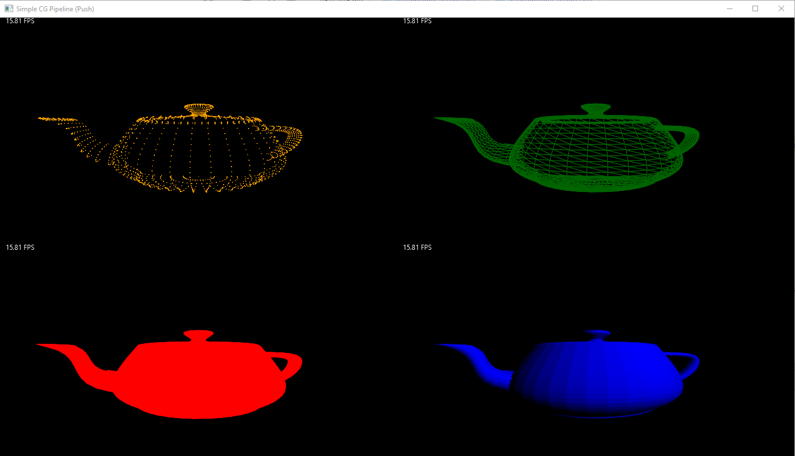
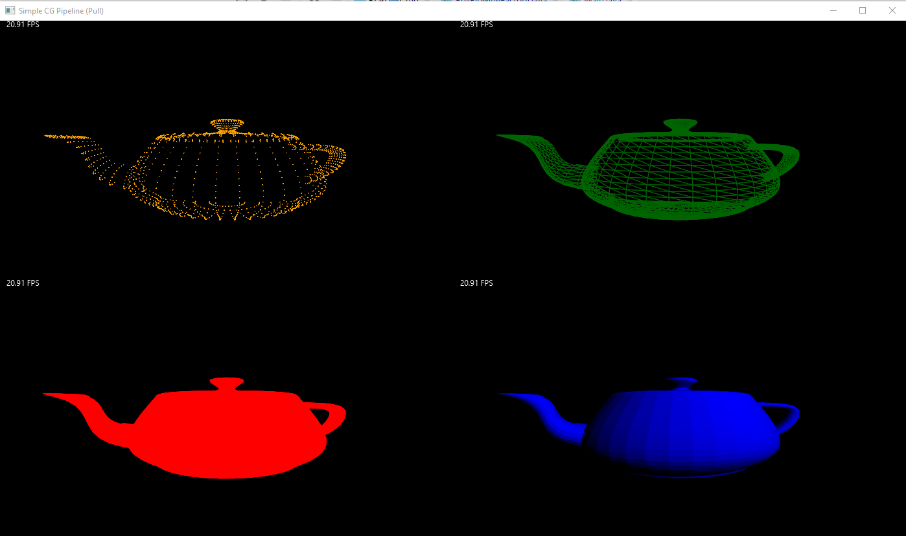

# Systemarchitekturen Lab 3 (Pipes and Filters)

## Allgemeines
Github Repository verfügbar unter: https://github.com/bianca482/Lab3_PipesAndFilters

Zum Starten der Applikation wird Java Version 11 benötigt.
In der Klasse Main wurde die Größe der Applikation (VIEW_WITH + VIEW_HEIGHT) leicht abgeändert.

Beim Starten aus der IDE muss zum Wechseln zwischen der Push- und Pull-Pipeline muss der Wert von USE_PUSH_PIPELINE abgeändert werden.

Ansonsten wurden auch zwei jar-Files erstellt, welche mittels Kommandozeile wie folgt gestartet werden können:
1. Wechsel in Verzeichnis in dem sich das Jar-File und die Objectfiles des resources-Ordners befinden
2. Programm starten: *java -p  "<java_fx_path>" --add-modules javafx.controls,javafx.fxml -jar pushPipeline.jar|pullPipeline.jar* (wobei <java_fx_path> mit dem JAVA FX-Installationspfad des eigenen PCs angepasst werden muss.)

## Architektur

### Push Pipeline
Die PushPipeline verwendet eine **generische PushPipe**, welche wiederrum das **PushPipe Interface** implementiert.
Dieses Interface hat nur eine Methode, nämlich write. Diese Methode verwendet den Datentyp T, damit beliebige
Datentypen verwendet werden können. Die generische Pipe wurde zudem implementiert, um beliebige Filter mit einer Pipe verbinden zu können.
Hierbei wurde für die **Filter** ein Interface implementiert, bei welchem es jeweils einen generischen Input- und Output Typ gibt.
Das Interface hat zwei Methoden - die write und die setSuccessor Methode.
Die write-Methode verwendet den Datentyp T als Input und wird verwendet um dem Input zu verarbeiten und diesen an den Nachfolger weiterzugeben. Der Nachfolger wird mit der setSuccessor-Methode gesetzt, welcher den Datentyp W als Output verwendet.

Die **Verknüpfung zwischen den Pipes und Filtern** erfolgt in der PushPipelineFactory.
Beim Erstellen einer Pipe wird der nachfolgende Filter im Konstruktor gesetzt.
Beim jeweiligen Filter muss die Nachfolger Pipe über die setSuccessor-Methode gesetzt werden.

Bei der Push Pipeline pusht die ModelSource zunächst alle Faces auf die nachfolgende Pipe, welche
wiederrum dem nachfolgenden Filter die Daten weitergibt. Es wurde hierbei gleich eine Liste aller
Faces übergeben, damit später das Depth Sorting leichter umgesetzt werden kann. Dieser Workaround wurde so gewählt, da ein Filter in der Push Pipeline keine Möglichkeit die Daten aktiv abzufragen - für das Depth Sorting ist es jedoch notwendig zu wissen, wann alle Faces erhalten wurden. Aus diesem Grund ist das Implementieren des Depth Sorting in der Pull Pipeline effektiver und einfacher umzusetzen als in der Push Pipeline. 
Nach dem Depth Sorting wird nur noch ein einzelnes Face (später auch als Pair mit der Farbe) weitergegeben.
Ansonsten ist der Ablauf immer derselbe -> die Filter führen ihre Transformationen und Berechnungen
durch, pushen die Ergebnisse auf die Pipe, welche die Daten wiederrum an den nächsten Filter weiterleitet.
Der ganze Prozess in Gang gesetzt, indem die Source als aktives Element die Faces auf die 
nachfolgende Pipe pushed.

Das schlussendliche Ergebnis sieht folgendermaßen aus:

### Pull Pipeline
Der Aufbau der PullPipeline bezüglich der **Pipes** ist derselbe wie bei der Push Pipeline, mit dem Unterschied, dass
hierbei eine read statt der write Methode zur Verfügung gestellt wird.

Hierbei wurde für die **Filter** ein Interface implementiert, bei welchem es jeweils einen generischen Input- und Output Typ gibt.
Das Interface hat zwei Methoden - die read und die setPredecessor Methode.
Die read-Methode verwendet den predecessor um den Input vom Datentyp W zu lesen, verarbeitet die Daten und gibt diese mit den Datentyp T zurück. 

Die **Verknüpfung zwischen den Pipes und Filtern** erfolgt in der PullPipelineFactory.
Beim Erstellen einer Pipe wird der vorherige Filter im Konstruktor gesetzt.
Beim jeweiligen Filter muss die Vorgänger Pipe über die setPredecessor-Methode gesetzt werden.

Im Fall der Pull Pipeline ist die ModelSink das einzige aktive Element. Diese triggert durch
das Pullen der vorgehenenden Pipe den ganzen Prozess. 
Die Filter haben nun alle einen Pipe-Vorgänger und in einer Pipe wird der Filter gespeichert, 
von welcher die Pipe der Input erhält (Filter-Vorgänger). Ein Filter pullt nun die Daten von der vorgehenden
Pipe, welche wiederrum von seinem vorgehenden Filter die Daten pullt und dem aufrufenden Filter zurückgibt. 

Das Resultat des Renderings der Pull Pipeline sieht folgendermaßen aus:

Weitere Bilder zum Vergleich der Push- und Pull Pipeline sind unter Lab3_PipesAndFilters\resources\pictures ersichtlich.
