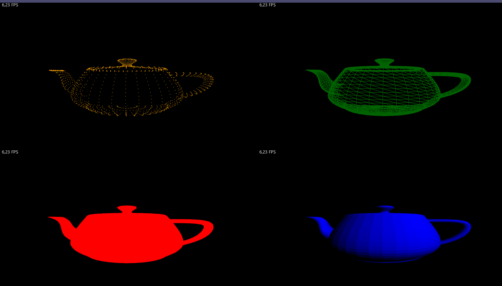
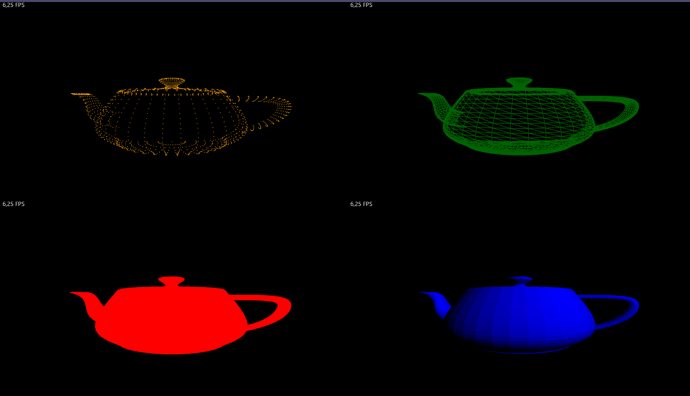

# Systemarchitekturen Lab 3 (Pipes and Filters)

## Allgemeines
Github Repository verfügbar unter: https://github.com/bianca482/Lab3_PipesAndFilters

In der Klasse Main wurde die Größe der Applikation (VIEW_WITH + VIEW_HEIGHT) leicht abgeändert.
Zum Wechseln zwischen der Push- und Pull-Pipeline muss der Wert von USE_PUSH_PIPELINE abgeändert werden.

## Architektur
- Architektur erklären (von Push & Pull Pipeline) ->
    - Funktionsweise,
    - welche Interfaces,
    - Verschachtelung (müssen Nachfolger oder Vorgänger angegeben werden müssen)
- Screenshot beider Pipelines
- Erstellung Rotationsmatrix bei uns in ModelView Filter, nicht in render() von PipelineFactory

Bei beiden Pipelines wurde die Rotationsmatrix im ersten Filter (ModelViewTransformation) erstellt.

### Push Pipeline

### Pull Pipeline

